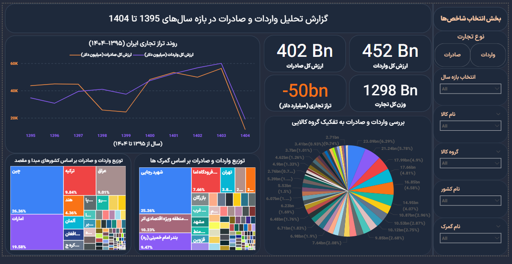

Iran Trade Analysis — Imports & Exports (Power BI)

Steps
- Integrated 9 years of data; standardized codes/names
- DAX measures: exports, imports, trade balance, trade weight
- Interactive visuals + dynamic slicers (type/year/country/product)

Outcome
Actionable insights into trade trends, partners, and commodity groups.

