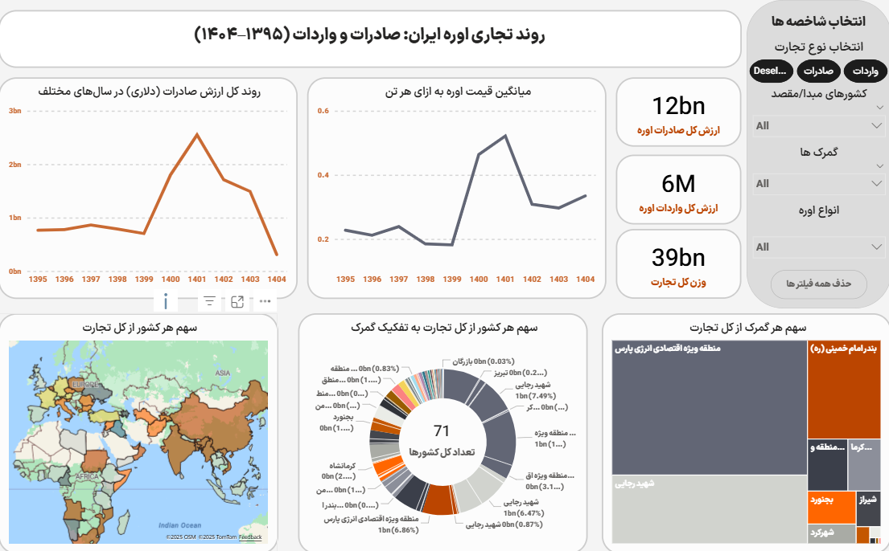

# Urea Export Analysis Dashboard

Steps
9 years of urea export data consolidated into a single, clean model to enable dynamic analysis.
- Data cleaning: standardized country names & codes; merged yearly files; dedup & missing handling
- Modeling: fact & dimension tables; seasonal/section grouping
- Power BI: dynamic titles & KPI cards; DAX measures (total export, trade value, unit price)

Outcome
Trend analysis by year, country share, and customs distribution.

